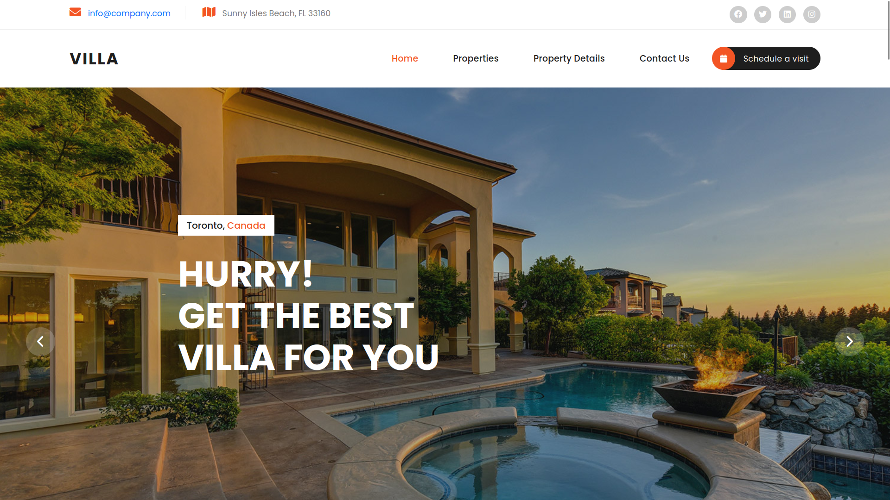
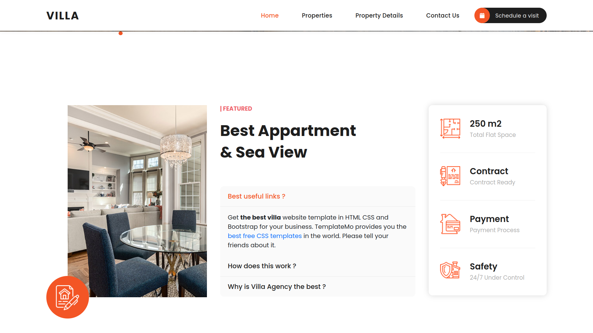
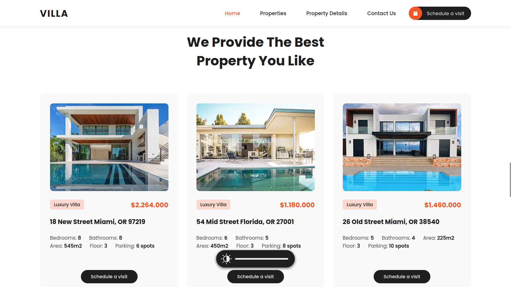
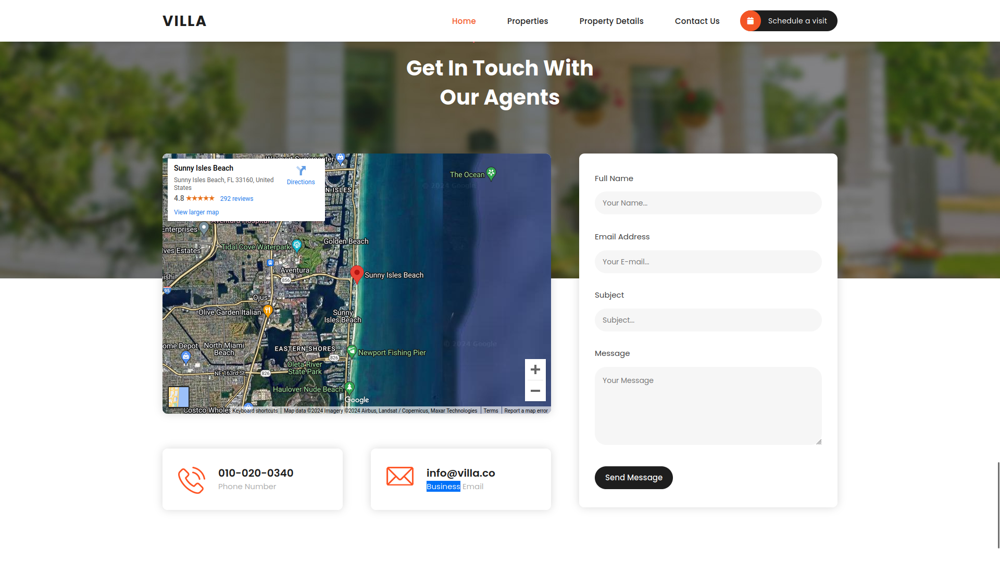

# Villa.com

Welcome to Villa.com, your ultimate destination for booking villas for parties and weekend holidays. This project is developed using Django, Python, HTML, CSS, and JavaScript.

## Table of Contents

- [Project Overview](#project-overview)
- [Features](#features)
- [Installation](#installation)
- [Usage](#usage)
- [Folder Structure](#folder-structure)
- [Technologies Used](#technologies-used)
- [Contributing](#contributing)
- [License](#license)

## Project Overview

Villa.com is a web application that allows users to browse, view details, and schedule visits for various properties. It aims to provide a seamless experience for users looking to book villas for their vacations or events.

## Features

- **Home:** Landing page with an overview of the website.
- 
- **Properties:** List of available properties for booking.
- 
- **Property Details:** Detailed information about each property.
- 
- **Contact Us:** Contact form for user inquiries.
- 
- **Schedule a Visit:** Form to schedule a visit to a property.

## Installation

To get a local copy up and running, follow these simple steps:

1. **Clone the repository:**

    ```bash
    git clone https://github.com/yourusername/villa.com.git
    cd villa.com
    ```

2. **Create a virtual environment:**

    ```bash
    python3 -m venv venv
    source venv/bin/activate
    ```

3. **Install the dependencies:**

    ```bash
    pip install -r requirements.txt
    ```

4. **Apply migrations:**

    ```bash
    python manage.py migrate
    ```

5. **Run the development server:**

    ```bash
    python manage.py runserver
    ```

6. **Access the website:**

    Open your browser and go to `http://127.0.0.1:8000/`

## Usage

- Navigate to the home page to see the overview.
- Browse the properties from the "Properties" section.
- View detailed information about a property in the "Property Details" section.
- Use the "Contact Us" form for inquiries.
- Schedule a visit to a property using the "Schedule a Visit" form.

## Folder Structure

```plaintext
villa.com/
├── manage.py
├── README.md
├── requirements.txt
├── villa/
│   ├── __init__.py
│   ├── settings.py
│   ├── urls.py
│   ├── wsgi.py
│   ├── asgi.py
├── properties/
│   ├── migrations/
│   ├── static/
│   ├── templates/
│   ├── __init__.py
│   ├── admin.py
│   ├── apps.py
│   ├── models.py
│   ├── tests.py
│   ├── views.py
├── contact/
│   ├── migrations/
│   ├── templates/
│   ├── __init__.py
│   ├── admin.py
│   ├── apps.py
│   ├── models.py
│   ├── tests.py
│   ├── views.py


Technologies Used

    Backend: Django, Python
    Frontend: HTML, CSS, JavaScript
    Database: SQLite (default with Django)

Contributing

Contributions are what make the open-source community such an amazing place to learn, inspire, and create. Any contributions you make are greatly appreciated.

    Fork the project
    Create your feature branch (git checkout -b feature/AmazingFeature)
    Commit your changes (git commit -m 'Add some AmazingFeature')
    Push to the branch (git push origin feature/AmazingFeature)
    Open a pull request
